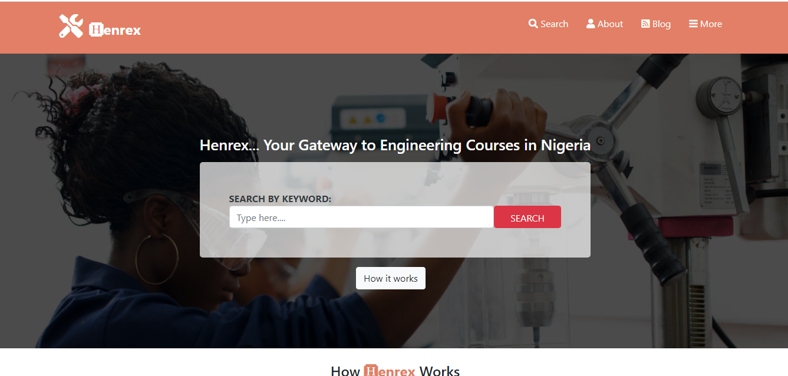
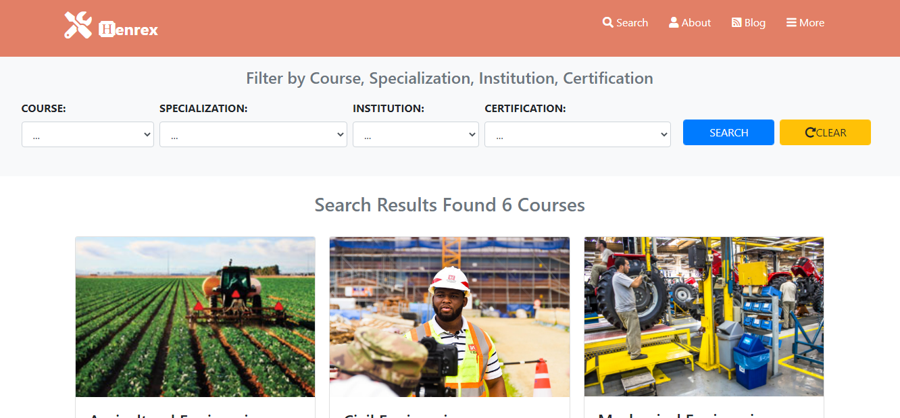
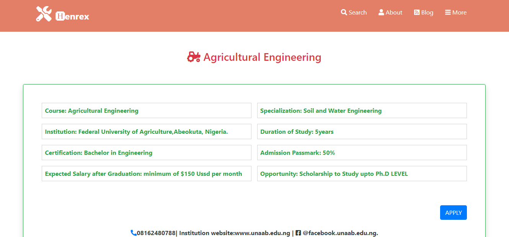

# Capstone-Html-Css

This is a Directory of Engineering Courses (Specializations) for prospective Undergraduate students so they can have the required information for gaining admission to studying Engineering courses of their choice in Nigeria.The website has Three pages namely The Main page, The Search page and The Detail page which are fully responsive on Desktop, Tablet and Mobile Phone screensizes.

## Built With

- HTML
- CSS
- BOOTSTRAP

## Live Demo

[Live Demo Link](https://henryhaulka.github.io/Capstone-Html-Css/)

## Getting Started

**To visit the page go to the live demo link**

### Pre-requisites

1. An internet browser
2. A Computer / Mobile phone / Tablet

## Authors

👤 Onu Henry Chibuike

- Github: [@Henryhaulka](https://github.com/Henryhaulka)
- Twitter: [@ONUHENRY12](https://twitter.com/ONUHENRY12)
- Linkedin: [Henry Onu](https://www.linkedin.com/in/henry-onu-9a15b11b6/)

## 🤝 Contributing

Contributions, issues and feature requests are welcome!

Feel free to check the [issues page](https://github.com/Henryhaulka/Capstone-Html-Css/issues).

## Show your support

Give a ⭐️ if you like this project!

## Acknowledgments

Thanks to  Mathew Njuguna and others on Behance for inspiring us.

## 📝 License

This project is [MIT](lic.url) licensed.
